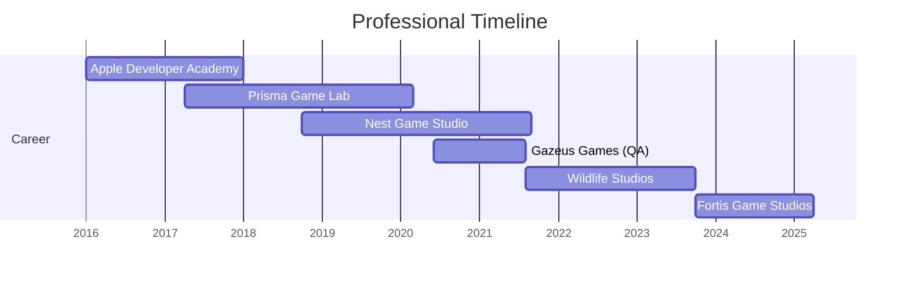

# 
👋 Hi, I'm Michelle Santiago!

  
  
  

  
<i>Developer with 7+ years of experience creating gameplay systems that don't just work, but inspire and connect. My mission is to give back to the industry the transformative experiences that brought me here.</i>

## 🎮 About Me

- 🔭 Currently working on game development and gameplay systems
- 🌱 Constantly learning about new technologies and optimization techniques
- 👯 Looking to collaborate on innovative and purposeful projects
- 💬 Talk to me about game development, combat systems, or innovative mechanics!
- 📫 Contact: [michelle.santiago10@gmail.com](mailto:michelle.santiago10@gmail.com)
- 😄 Pronouns: She/Her
- ⚡ Fun fact: My cat is named Cali, inspired by my game "Fireflies" which was featured on Game Maker's Toolkit!

## 📊 Languages and Tools

  
  
  
  
  
  
  
  
  

## 🏆 Professional Experience

## 🎯 Featured Projects

  
   
  

## 📈 GitHub Stats

  

  

## 🔝 Recent Contributions

<!--START_SECTION:activity-->
<!-- Contributions will be automatically updated here with a GitHub Action setup -->
<!--END_SECTION:activity-->

## 🎤 Speaking and Mentoring

- 🎮 Speaker: "Diversity inside the game industry" - Game XP (2019)
- 🚀 Scholar: Game Developers Conference (GDC) - Abragames (2019)
- 👩‍💻 Mentor: Woman Game Jam - Rio de Janeiro (2019)
- 🎲 Local Host: Global Game Jam - PUC-Rio (2020)

## 🌐 Connect With Me

  
  
  

---

  
   
  <i>"Developing games is about creating worlds where rules can be broken and remade. It's this freedom that inspires me every day."</i>

